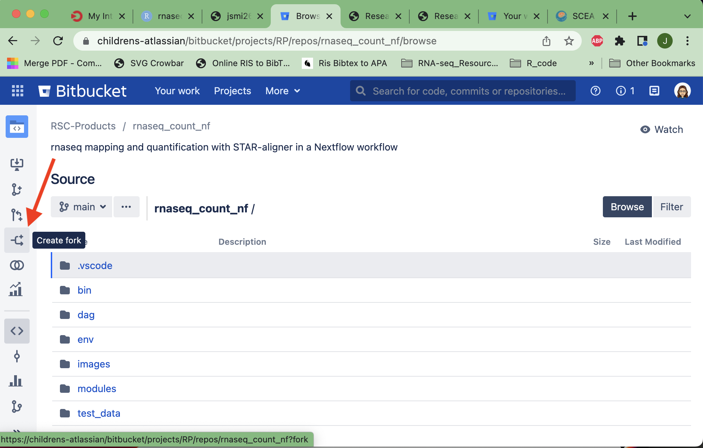
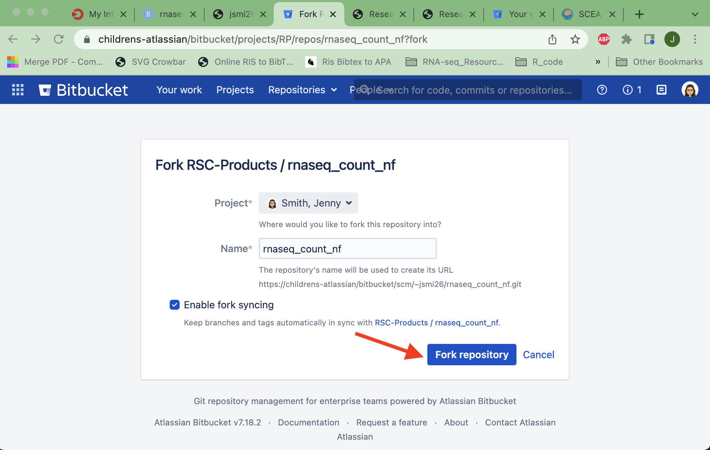
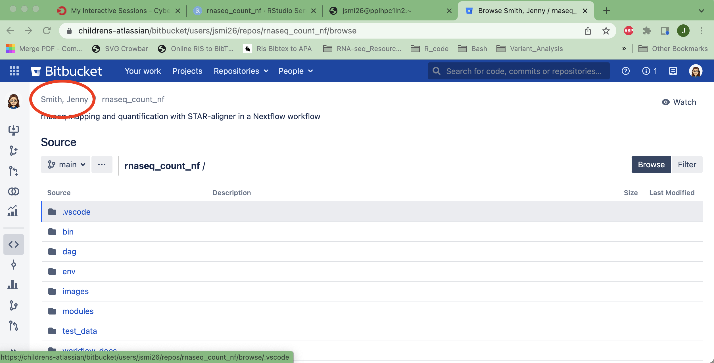
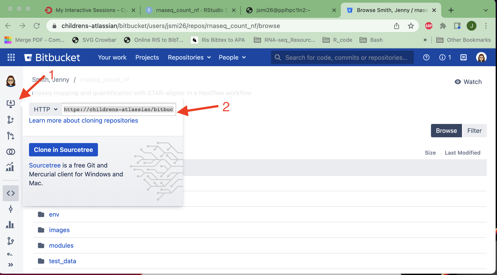

# Cut&Run Alignement, QC, and Peak Calling Pipeline

This pipeline uses publically available modules from [nf-core](https://nf-co.re/) with some locally created modules. The primary functionality is to run a workflow on 10s - 1000s of samples in parallel on the Seattle Children's Cybertron HPC using the PBS job scheduler and containerized scientific software.

First, follow the steps on this page to make a personal copy of this repository. Then, the **step-by-step instructions to run the workflow: [`workflow_docs/workflow_run.md`](workflow_docs/run_workflow.md)** can be used. 

# Background Information 

SEACR Methodology:

  * [SEACR publication](https://epigeneticsandchromatin.biomedcentral.com/articles/10.1186/s13072-019-0287-4#Abs1)


Library Prep Protocol:

  * [Protocols.io](https://www.protocols.io/view/cut-amp-run-targeted-in-situ-genome-wide-profiling-14egnr4ql5dy/v3?step=113)

# About the Pipeline 

The pipeline runs the Bowtie2 alignment, quality trimming of reads with trimgalore, [SEACR](https://github.com/FredHutch/SEACR) peak calling, and optionally [MACS2](https://github.com/macs3-project/MACS) peak calling. MACS2 requires an effective genome size to call peaks, which you can provide directly or call [`unique-kmers.py`](https://deeptools.readthedocs.io/en/develop/content/feature/effectiveGenomeSize.html) to calculate the effective genome size on the fly. Coverage tracks are produced for visualization in [IGV](https://igv.org/doc/desktop/). 

It will also perform general QC statistics on the fastqs with [fastqc](https://www.bioinformatics.babraham.ac.uk/projects/fastqc/), the alignment, peak calling, and sample similarity using [deeptools](https://deeptools.readthedocs.io/en/develop/). Finally, the QC reports are collected into a single file using [multiQC](https://multiqc.info/).

A DAG (directed acyclic graph) of the workflow is show below:


# Activate the Environment

## Fork Code Repository

First, fork the [repository](https://childrens-atlassian/bitbucket/projects/RP/repos/cutandrun_nf/browse) from Children’s bitbucket. Do this by clicking the “create fork” symbol from the bitbucket web interface and fork it to your personal bitbucket account, as illustrated below.

The figures are from another pipeline, but the steps are the same for forking the respository and selecting the appropriate version. 






Next, you will need to clone your personal repository to your home in Cybertron. See the image below for where you can find the correct URL on your forked bitbucket repo. 





Copy that URL to replace the one below. 

```
#on a terminal on the Cybertron login nodes
cd ~
```

## Clone Repository

Note, your fork should have your own userID (rather than jsmi26).
git clone https://childrens-atlassian/bitbucket/scm/~jsmi26/cutandrun_nf.git

`cd ~/cutandrun_nf`

Once inside the code repository, use the latest release branch or make sure you're using the same release as prior analysis by using `git`.

```
git fetch
git branch -a
```

The git branch command will show all available remote branches, including remote branches, like:

* main
  remotes/origin/HEAD -> origin/main
  remotes/origin/dev
  remotes/origin/feature/sample_sheet_val
  remotes/origin/main
  remotes/origin/release/1.0.0
  remotes/origin/release/1.1.0
 

Checkout **most current release branch** using this command:

`git checkout release/1.1.0`

Which will state that you are now on `release/1.1.0` branch and that it is tracking the release branch in your personal repository. 

> Checking out files: 100% (55/55), done.
> Branch release/1.1.0 set up to track remote branch release/1.1.0 from origin
> Switched to a new branch 'release/1.1.0'


## Conda Environment

Optional: use [tmux](https://github.com/tmux/tmux/wiki) on the cybertron login nodes. Name the session nextflow and then request an interactive session before activating the nextflow conda environment. The project codes can be found with `project info` command. 

Change the `QUEUE` and `NAME` variables in the code chunk below to be accurate for your Cybertron projects. 

```
tmux new-session -s nextflow
NAME="RSC_adhoc"
QUEUE="sceaq"
qsub -I -q $QUEUE -P $(project code $NAME) -l select=1:ncpus=1:mem=8g -l walltime=8:00:00
```

Next, for the conda environment to be solved, you will need to set channel_priority to flexible in your conda configs as well. To read more about conda environments and thier configurations, check out the [documentation](https://docs.conda.io/projects/conda/en/latest/commands/config.html#conda-config). 

```
# print your current conda settings
conda config --describe channel_priority 
# set to flexible if not already done
conda config --set channel_priority flexible 
```

Then create the conda environment that has the appropriate software, including `nextflow`, `nf-core`, and `graphviz`. The conda environment will need to be built only 1 time, afterwards, simply use `conda activate nextflow`.

```
conda env create -f env/nextflow.yaml
conda activate nextflow
```
### Optional: Conda/Mamba at SCRI

SCRI uses a TLS and/or SSL Certificate to inspect web traffic and its specific to SCRI. Nextflow itself orchestrates many types of downloads such as genomic references, scientific software images from public repositories, and conda packages. 

If you are running into SSL errors, you will need to configure your conda installation to use SCRI certificates. 

Please see Research Scientific Computing for more help in getting set-up and this [bitbucket repo](https://childrens-atlassian/bitbucket/projects/EC/repos/) for the current certificates. 

# Run the pipeline 

Open the step-by-step instructions to run the workflow in **[`workflow_docs/workflow_run.md`](workflow_docs/run_workflow.md)**. 

## Authors

- [Jenny L. Smith](https://github.com/jennylsmith)

## Acknowledgements

This pipeline was generated using `nf-core tools` CLI suite and publically available modules from [`nf-core`](https://nf-co.re/about). 

> The nf-core project came about at the start of 2018. Phil Ewels (@ewels) was the head of the development facility at NGI Stockholm (National Genomics Infrastructure), part of SciLifeLab in Sweden.

> The NGI had been developing analysis pipelines for use with it’s genomics data for several years and started using a set of standards for each pipeline created. This helped other people run the pipelines on their own systems; typically Swedish research groups at first, but later on other groups and core genomics facilities too such as QBIC in Tübingen.

> As the number of users and contributors grew, the pipelines began to outgrow the SciLifeLab and NGI branding. To try to open up the effort into a truly collaborative project, nf-core was created and all relevant pipelines moved to this new GitHub Organisation.

> The early days of nf-core were greatly shaped by Alex Peltzer (@apeltzer), Sven Fillinger (@sven1103) and Andreas Wilm (@andreas-wilm). Without them, the project would not exist."