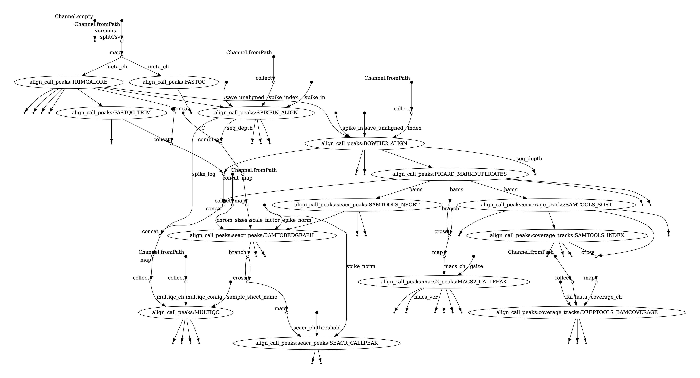

Run Cut&Run Peak Calling
================

- [About the Pipeline](#about-the-pipeline)
- [Activate the Environment on HPC](#activate-the-environment-on-hpc)
- [Examine the Sample Sheet](#examine-the-sample-sheet)
- [Run the Example Data](#run-the-example-data)
- [Configure Pipeline for Your Data](#configure-pipeline-for-your-data)
  - [Configuration file](#configuration-file)
  - [Global Params](#global-params)
  - [Genomic References](#genomic-references)
  - [Optional: MACS2](#optional-macs2)
  - [Advanced Options](#advanced-options)
- [Run Script](#run-script)
  - [Alignment and Peak Calls](#alignment-and-peak-calls)
  - [Optional: Build the Index and Exit
    Pipeline](#optional-build-the-index-and-exit-pipeline)
- [Expected Outputs](#expected-outputs)
  - [Pipeline Reports](#pipeline-reports)

# About the Pipeline

The pipeline runs the
[Bowtie2](https://bowtie-bio.sourceforge.net/bowtie2/manual.shtml)
alignment, quality trimming of reads with trimgalore,
[SEACR](https://github.com/FredHutch/SEACR) peak calling, and optionally
[MACS2](https://github.com/macs3-project/MACS) peak calling. MACS2
requires an effective genome size to call peaks, which you can provide
directly or call
[`unique-kmers.py`](https://deeptools.readthedocs.io/en/develop/content/feature/effectiveGenomeSize.html)
to calculate the effective genome size on the fly. Coverage tracks are
produced for visualization in [IGV](https://igv.org/doc/desktop/).

It will also perform general QC statistics on the fastqs with
[fastqc](https://www.bioinformatics.babraham.ac.uk/projects/fastqc/),
the alignment, peak calling, and sample similarity using
[deeptools](https://deeptools.readthedocs.io/en/develop/). Finally, the
QC reports are collected into a single file using
[multiQC](https://multiqc.info/).

A DAG (directed acyclic graph) of the workflow is show below:

# Activate the Environment on HPC

The directions to set-up the Nextflow workflow requirements are found in
the [README.md](../README.md). Ensure that you have followed the steps
to fork and clone the repository and created the conda nextflow
environment before starting with this document.

Optional but recommended: use `tmux` on the cybertron login nodes. Name
the session nextflow and then request an interactive session, then
activate the nextflow conda environment. The project codes can be found
with `project info` command. Change the `$QUEUE` and `$NAME` variables
in the code chunk below to be accurate for your Cybertron projects.

Navigate to where you place the cloned (copied) cutandrun_nf directory,
and then checkout the latest release branch.

Activate the Nextflow conda environment.

# Examine the Sample Sheet

A sample sheet in csv (comma separated values) format is used as input
to the pipeline. This sample sheet **must** have the following column
names in any order:

- “sample”
- “sample_id”
- “target_or_control”
- “single_end”
- “read1”
- “read2”

Below is an example of a complete sample sheet for use in the pipeline,
which can be edited for your own samples in
`test_data/test_dataset_sample_sheet.csv`.

    ##   sample   sample_id single_end target_or_control
    ## 1     M1 M1_H3K27_NK      false            target
    ## 2     M1  M1_H3K4_NK      false            target
    ## 3     M1   M1_IgG_NK      false           control
    ## 4     M2 M2_H3K27_NK      false            target
    ## 5     M2  M2_H3K4_NK      false            target
    ## 6     M2   M2_IgG_NK      false           control
    ##                                                                                           read1
    ## 1 /gpfs/shared_data/demo_data/mus_musculus/cutandrun/fastqs/M1_H3K27_NK_chr17_R1_ecoli.fastq.gz
    ## 2  /gpfs/shared_data/demo_data/mus_musculus/cutandrun/fastqs/M1_H3K4_NK_chr17_R1_ecoli.fastq.gz
    ## 3   /gpfs/shared_data/demo_data/mus_musculus/cutandrun/fastqs/M1_IgG_NK_chr17_R1_ecoli.fastq.gz
    ## 4 /gpfs/shared_data/demo_data/mus_musculus/cutandrun/fastqs/M2_H3K27_NK_chr17_R1_ecoli.fastq.gz
    ## 5  /gpfs/shared_data/demo_data/mus_musculus/cutandrun/fastqs/M2_H3K4_NK_chr17_R1_ecoli.fastq.gz
    ## 6   /gpfs/shared_data/demo_data/mus_musculus/cutandrun/fastqs/M2_IgG_NK_chr17_R1_ecoli.fastq.gz
    ##                                                                                           read2
    ## 1 /gpfs/shared_data/demo_data/mus_musculus/cutandrun/fastqs/M1_H3K27_NK_chr17_R2_ecoli.fastq.gz
    ## 2  /gpfs/shared_data/demo_data/mus_musculus/cutandrun/fastqs/M1_H3K4_NK_chr17_R2_ecoli.fastq.gz
    ## 3   /gpfs/shared_data/demo_data/mus_musculus/cutandrun/fastqs/M1_IgG_NK_chr17_R2_ecoli.fastq.gz
    ## 4 /gpfs/shared_data/demo_data/mus_musculus/cutandrun/fastqs/M2_H3K27_NK_chr17_R2_ecoli.fastq.gz
    ## 5  /gpfs/shared_data/demo_data/mus_musculus/cutandrun/fastqs/M2_H3K4_NK_chr17_R2_ecoli.fastq.gz
    ## 6   /gpfs/shared_data/demo_data/mus_musculus/cutandrun/fastqs/M2_IgG_NK_chr17_R2_ecoli.fastq.gz

# Run the Example Data

To ensure that the pipeline works, first run the test data set. This
example will run using the data found in the `test_sample_sheet.csv`.

# Configure Pipeline for Your Data

## Configuration file

Open the configuration file `nextflow.config` and edit the necessary
parameters for building the index, and/or running the alignment or peak
calling steps.

    ## //working directory for temporary/intermediate files produced in the workflow processes
    ## workDir = "$HOME/temp"
    ## 
    ## //global parameters
    ## params {
    ##     // general options
    ##     sample_sheet                = "./test_data/test_dataset_sample_sheet.csv"
    ##     queue                       = 'paidq'
    ##     project                     = '207f23bf-acb6-4835-8bfe-142436acb58c'
    ##     outdir                      = "./results/mouse"
    ##     peaks_outdir                = "${params.outdir}/peaks_calls"
    ##     publish_dir_mode            = 'copy'
    ## 
    ##     //Bowtie params for target genome
    ##     build_index                 = false
    ##     fasta                       = '/gpfs/shared_data/Bowtie2/mm39.fa' // required
    ##     index                       = '/gpfs/shared_data/Bowtie2/mm39_index/' // bowtie2 index path is required unless `build_index = true`
    ##     save_unaligned              = false
    ## 
    ##     // Bowtie params for spike-in genome
    ## <...>

## Global Params

Be sure to change the following lines for the global parameters:

- sample_sheet
- queue
- project code
- outdir
- peak_outdir

<!-- -->

    ## Warning in params_lines[1]:end: numerical expression has 2 elements: only the
    ## first used

    ## //global parameters
    ## params {
    ##     // general options
    ##     sample_sheet                = "./test_data/test_dataset_sample_sheet.csv"
    ##     queue                       = 'paidq'
    ##     project                     = '207f23bf-acb6-4835-8bfe-142436acb58c'
    ##     outdir                      = "./results/mouse"
    ##     peaks_outdir                = "${params.outdir}/peaks_calls"
    ##     publish_dir_mode            = 'copy'

## Genomic References

Additionally, determine if you require a new bowtie2 index to be build
for the target genome and/or the spike-in genome. The pipeline requires
either a fasta filepath OR Bowtie2 index filepath. This is also required
for the spike-in, with E. Coli provided as a default.

E. coli is the default since it that is a carry over DNA from the
Cut&Run library prep methodology and is expected to be present in all
Cut&Run experiments regardless if exogenous spike-in is used like Yeast.
Please see [here](https://doi.org/10.7554/eLife.46314) for more
information on spike-in normalization.

Change the following lines for alignment reference files when needed:

- build_index
- fasta
- index
- build_spike_index
- spike_fasta
- spike_index

<!-- -->

    ##     //Bowtie params for target genome
    ##     build_index                 = false
    ##     fasta                       = '/gpfs/shared_data/Bowtie2/mm39.fa' // required
    ##     index                       = '/gpfs/shared_data/Bowtie2/mm39_index/' // bowtie2 index path is required unless `build_index = true`
    ##     save_unaligned              = false
    ## 
    ##     // Bowtie params for spike-in genome

## Optional: MACS2

Finally, decide whether to run MACS2 calls along with the SEACR peak
calling algorithm (default = true). MACS2 will use the effective genome
size value provided in `gsize` parameter.

If you are using a non-model organism or simply don’t want to use the
effective genome size provided in literature or MACS2 documentation, you
can set `run_khmer = true` to calculate an effective genome size using
the target genome fasta `fasta` filepath and read-length.

- gsize
- run_macs2
- run_khmer

<!-- -->

    ##     //Effective genome size for target genome
    ##     gsize                       = 1.87e9 //default genome size from MACS2 
    ##     <...>
    ##     //MACS2 and khmer params
    ##     run_macs2                   = true
    ##     run_khmer                   = false //if true, will override the value in gsize parameter
    ##     kmer_size                   = 150 //kmer_size is the read-length

## Advanced Options

In the `nextflow.config`, you can define additional command line
arguments to the scientific software under [process
scope](https://www.nextflow.io/docs/latest/process.html#). You may use
the advanced options to change computational resources requested for
different processes. The CPUs and memory parameters can updated to
request a larger amount of resources like CPUs or memory if files are
large. You may also edit the commandline parameters for processes in the
workflow using the `ext.arg`
[directive](https://www.nextflow.io/docs/latest/process.html#directives).
Please be aware the **default command line parameters for `Bowtie2`
processes are already provided for both target and spike-in alignment**,
but can be edited.

The most commonly modified and important process parameters are listed
toward the top of the process scope in the `nextflow.config` file.

You can edit the command line parameters for `SEACR` and `MACS2`
parameters that often need to be re-run multiple times when deciding on
the appropriate peak-set to use. For example, `MACS2` broad and narrow
peak calling parameters for different histone modifications which can be
modified using the `ext.args` parameter.

    ##   [1] // Computational resource allocation for the processes run in the workflow                                     
    ##   [2] process {                                                                                                      
    ##   [3]     //Bowtie2 aligner process specific parameters                                                              
    ##   [4]     withName: BOWTIE2_ALIGN {                                                                                  
    ##   [5]         cpus = { 2 * task.attempt }                                                                            
    ##   [6]         memory = { 32.GB * task.attempt }                                                                      
    ##   [7]         ext.prefix = { "${meta.id}.sort" }                                                                     
    ##   [8]         ext.args = '--local --very-sensitive-local --no-unal --no-mixed --no-discordant --phred33 -I 10 -X 700'
    ##   [9]         ext.args2 = ''      //command line arguments for `samtools sort`                                       
    ##  [10]     }                                                                                                          
    ##  [11]     //SEACR peak calling resources                                                                             
    ##  [12]     withName: SEACR_CALLPEAK {                                                                                 
    ##  [13]         cpus = { 1 * task.attempt }                                                                            
    ##  [14]         memory = { 16.GB * task.attempt }                                                                      
    ##  [15]         ext.version = '1.4' //version 1.3 and 1.4 supported                                                    
    ##  [16]         ext.args = '--normalize norm --mode stringent --remove yes'                                            
    ##  [17]         publishDir = [...]                                                                                     
    ##  [18]                                                                                                                
    ##  [19]     }                                                                                                          
    ##  [20]     //MACS2 peak calling resources                                                                             
    ##  [21]     withName: MACS2_CALLPEAK {                                                                                 
    ##  [22]         cpus = { 1 * task.attempt }                                                                            
    ##  [23]         memory = { 16.GB * task.attempt }                                                                      
    ##  [24]         ext.args = '-q 0.01 --keep-dup all'                                                                    
    ##  [25]         publishDir = [...]                                                                                     
    ##  [26]                                                                                                                
    ##  [27]     }                                                                                                          
    ##  [28]     //BAMCOVERAGE bigwig file  parameters                                                                      
    ##  [29]     withName: DEEPTOOLS_BAMCOVERAGE {                                                                          
    ##  [30]         cpus = { 4 * task.attempt }                                                                            
    ##  [31]         memory = { 16.GB * task.attempt }                                                                      
    ##  [32]         ext.args = '--normalizeUsing CPM --centerReads --verbose'                                              
    ##  [33]     }                                                                                                          
    ##  [34]     //Picard to mark duplicate reads                                                                           
    ##  [35]     withName: PICARD_MARKDUPLICATES {                                                                          
    ##  [36]         cpus = { 2 * task.attempt }                                                                            
    ##  [37]         memory = { 32.GB * task.attempt }                                                                      
    ##  [38]         ext.prefix = { "${meta.id}.markedDup" }                                                                
    ##  [39]         ext.args = '--CREATE_MD5_FILE true --CREATE_INDEX true'                                                
    ##  [40]     }                                                                                                          
    ##  [41]     //Picard to Remove duplicate reads                                                                         
    ##  [42]     withName: PICARD_RMDUPLICATES {                                                                            
    ##  [43]         cpus = { 2 * task.attempt }                                                                            
    ##  [44]         memory = { 32.GB * task.attempt }                                                                      
    ##  [45]         ext.prefix = { "${meta.id}.rmDup" }                                                                    
    ##  [46]         ext.args = '--REMOVE_DUPLICATES true --CREATE_MD5_FILE true --CREATE_INDEX true'                       
    ##  [47]     }                                                                                                          
    ##  [48]     //Samtools to filter the aligned reads                                                                     
    ##  [49]     if ( params.filter_bam ){                                                                                  
    ##  [50]         withName: SAMTOOLS_VIEW {                                                                              
    ##  [51]             cpus = { 2 * task.attempt }                                                                        
    ##  [52]             memory = { 32.GB * task.attempt }                                                                  
    ##  [53]             ext.prefix = { "${input.baseName}.filter" }                                                        
    ##  [54]             ext.args = { "-q $params.mapq" }                                                                   
    ##  [55]         }                                                                                                      
    ##  [56]     }                                                                                                          
    ##  [57]     //Samtools sort by read name parameters                                                                    
    ##  [58]     withName: SAMTOOLS_NSORT {                                                                                 
    ##  [59]         cpus = { 1 * task.attempt }                                                                            
    ##  [60]         memory = { 32.GB * task.attempt }                                                                      
    ##  [61]         ext.prefix = { "${bam.baseName.replaceAll(/.sort/,"")}.nsort" }                                        
    ##  [62]         ext.args = '-n'                                                                                        
    ##  [63]     }                                                                                                          
    ##  [64]     //convert bamtobed to bedgraph process specific resources                                                  
    ##  [65]     withName: BAMTOBEDGRAPH {                                                                                  
    ##  [66]         cpus = { 1 * task.attempt }                                                                            
    ##  [67]         memory = { 8.GB * task.attempt }                                                                       
    ##  [68]         ext.args = '' //for bedtools bamtobed                                                                  
    ##  [69]         ext.args2 = '' //for bedtools genomecov                                                                
    ##  [70]     }                                                                                                          
    ##  [71]     //Samtools sort by coordinate (for bedtools process below)                                                 
    ##  [72]     withName: SAMTOOLS_SORT {                                                                                  
    ##  [73]         cpus = { 1 * task.attempt }                                                                            
    ##  [74]         memory = { 32.GB * task.attempt }                                                                      
    ##  [75]         ext.prefix = { "${bam.baseName}.sort" }                                                                
    ##  [76]         ext.args = ''                                                                                          
    ##  [77]     }                                                                                                          
    ##  [78]     //Samtools sort by coordinate (for bedtools process below)                                                 
    ##  [79]     withName: SAMTOOLS_INDEX {                                                                                 
    ##  [80]         cpus = { 1 * task.attempt }                                                                            
    ##  [81]         memory = { 16.GB * task.attempt }                                                                      
    ##  [82]         ext.args = ''                                                                                          
    ##  [83]     }                                                                                                          
    ##  [84]     withName: SAMTOOLS_STATS {                                                                                 
    ##  [85]         cpus = { 1 * task.attempt }                                                                            
    ##  [86]         memory = { 16.GB * task.attempt }                                                                      
    ##  [87]         ext.args = ''                                                                                          
    ##  [88]     }                                                                                                          
    ##  [89]     if ( params.build_index ){                                                                                 
    ##  [90]         //Bowtie2 aligner process specific parameters                                                          
    ##  [91]         withName: BOWTIE2_BUILD {                                                                              
    ##  [92]             cpus = { 4 * task.attempt }                                                                        
    ##  [93]             memory = { 32.GB * task.attempt }                                                                  
    ##  [94]             ext.args = '--verbose'                                                                             
    ##  [95]         }                                                                                                      
    ##  [96]     }                                                                                                          
    ##  [97]     withName: SAMTOOLS_FAIDX {                                                                                 
    ##  [98]         cpus = { 1 * task.attempt }                                                                            
    ##  [99]         memory = { 16.GB * task.attempt }                                                                      
    ## [100]         ext.args = ''                                                                                          
    ## [101]     }

SEACR has the option to be set to SEACR v1.4 or SEACR v1.3 - which have
particularly different commandline interfaces, changes in the methods
for normalization to IgG, and v1.4 can optionally remove peaks found in
IgG. Please see [here](https://github.com/FredHutch/SEACR/releases) for
the full changelog.

For SEACR v1.3, Often, you will need to change `SEACR` from “non” to
“norm” for different normalization strategies whether you’re using IgG
normalization or spike-in normalization. The example below demonstrates
how to change the commandline params and version by editing
`ext.version` and `ext.args`.

    ##     //SEACR peak calling resources
    ##     withName: SEACR_CALLPEAK {
    ##         cpus = { 1 * task.attempt }
    ##         memory = { 16.GB * task.attempt }
    ##         ext.version = '1.3' //version 1.3 and 1.4 supported
    ##         ext.args = 'norm stringent'
    ##         publishDir = [...]
    ##                     
    ##     }

# Run Script

    ## • Edit '/Users/jsmi26/local_repos/cutandrun_nf/main_run.sh'

Decide on the `NFX_PROFILE`, which allows you to run the processes
either locally, or using the PBS job scheduler on Cybertron, and
determine if you’d like to use singularity containers or docker
containers.

2)  `PBS_singularity` \[DEFAULT, recommended\] \* you can submit a PBS
    job that will use singularity containers on Cybertron \* This takes
    care of requesting the appropriate resources using PBS

3)  `local_singularity` \* locally on an interactive session Cybertron
    with singularity \* requires appropriate computational resources be
    requested using
    `qsub -I -q <queue_name> -P <project_code> -l select=1:ncpus=4:mem=32GB`

Edit the script `main_run.sh` and change the values for the
`NFX_PROFILE` variable if desired.

    ## #Options: 'PBS_apptainer','local_apptainer','local_singularity', 'PBS_singularity'
    ## NFX_PROFILE='PBS_apptainer'

## Alignment and Peak Calls

Edit the variables in the `main_run.sh` script for entry-point of the
workflow. The default option *“align_call_peaks”* for the `NFX_ENTRY`
will run the full pipeline (QC, alignment, peak calling, coverage
tracks).

    ## #Options: 'bowtie2_index_only', 'align_call_peaks', 'call_peaks'
    ## NFX_ENTRY='align_call_peaks'

If you already have aligned BAM files, see
`test_data/test_dataset_bams_sample_sheet.csv` for an example to call
peaks only using the entry `call_peaks`.

    ## #Options: 'bowtie2_index_only', 'align_call_peaks', 'call_peaks'
    ## NFX_ENTRY='call_peaks'

Then, execute the `main_run.sh` script in order to complete the peak
calling on the samples. Provide a small descriptive prefix for the
pipeline run.

## Optional: Build the Index and Exit Pipeline

You can also change the entry-point of the workflow, which is
accomplished by setting the `NFX_ENTRY` variable in the `main_run.sh`
script to be `bowtie2_index_only`. This will allow the pipeline to run
only the Bowtie2 build process and exit upon completion of the index
building step.

    ## #Options: 'bowtie2_index_only', 'align_call_peaks', 'call_peaks'
    ## NFX_ENTRY='bowtie2_index_only'

# Expected Outputs

Under the path provided in the nextflow config for params “outdir”, you
will find directories named for each of the modules. Lets say
`params.outdir = ./results/mouse`, and
`peaks_outdir = "${params.outdir}/peak_calls"`.

There will be the following file structure:

- results/mouse/

  - bamtobedgraph/

  - bowtie2_align/

    - {sample_id}.bam
    - {sample_id}.bowtie2.log

  - deeptools_bamcoverage/

  - fastqc/

  - fastqc_trim/

  - multiqc/

  - peak_calls/

    - seacr_callpeak/
      - {sample_id}.\[norm or non\].\[stringent or relaxed\].bed
    - macs2_call_peak/
      - {sample_id}\_peaks.\[narrowPeak or broadPeak\]
      - {sample_id}\_peaks.xls
      - {sample_id}\_summits.bed

  - picard_markduplicates/

  - samtools_index/

  - samtools_nsort/

  - samtools_sort/

  - spikein_align/

    - {sample_id}\_spikein.bam
    - {sample_id}\_spikein.bowtie2.log

  - trimgalore/

    - {sample_id}\_1.gz_trimming_report.txt
    - {sample_id}\_2.gz_trimming_report.txt
    - {sample_id}.M1_H3K27_NK_1_val_1.fq.gz
    - {sample_id}.M1_H3K27_NK_1_val_2.fq.gz

## Pipeline Reports

In addition, there will be an HTML report with information on where the
temp data is stored in the `workDir` path, and general run statistics
such as resource utilized versus requested, which helps with
optimization. It will also provide information on how much walltime was
used per sample, total CPU hours, etc.

The HTML file is found in `reports` directory and will have the prefix
defined on the command line when the `./main_run.sh "my_analysis"` was
invoked, so in this example it would be named
“my_analysis\_{DATE}.html”.

There will also be a detailed nextflow log file that is useful for
de-bugging which will also be named in this example,
“my_analysis\_{DATE}\_nextflow.log”.

Finally, the pipeline will produce a DAG - Directed acyclic graph, which
describes the workflow channels (inputs) and the modules. The DAG image
will be saved under `dag/` directory with the name
“my_analysis\_{DATE}\_dag.pdf”.

